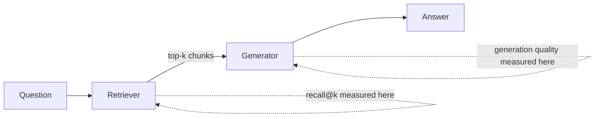

import Callout from '../../components/Callout.astro';

Most RAG systems are tuned by feel: change the chunk size, eyeball a few answers, ship it. That works right up until it doesn't, and by then you can't tell whether the model or the retriever is at fault. The fix is a number you can trust — and for retrieval-augmented generation, that number is recall, not a generation score. Generation scores like BLEU, ROUGE, or even LLM-as-judge ratings tell you whether the final answer *reads* well, but they can't tell you whether the evidence needed to answer correctly was ever in front of the model. Recall answers a narrower, more useful question: did the retriever surface the right chunk at all — and it's the only metric that isolates retrieval quality from everything downstream.

## Retrieval sets the ceiling

In a RAG pipeline the generator gets the attention, but the retriever decides what's possible. If the chunk that answers a question never makes it into the context window, no model — however capable — can answer from it. So the metric that actually predicts end-to-end quality is retrieval recall: did we fetch the right evidence at all?



Two separate failure modes live in that diagram, and they need two separate metrics. Conflating them is why "the model hallucinated" so often turns out to mean "the retriever never gave it a chance."

## Build a small labeled set

You don't need thousands of examples. Fifty to a hundred question-to-chunk pairs, drawn from real queries — support tickets, search logs, or questions you write yourself against the corpus — are enough to move from guessing to measuring. For each question, record the id of the chunk (or chunks) that genuinely answers it.

A few rows from a docs-search eval set might look like this:

| question | relevant_chunk_ids |
|---|---|
| "How do I rotate an API key?" | `auth-042`, `auth-043` |
| "What's the rate limit on the search endpoint?" | `limits-011` |
| "Can I use a service account for webhooks?" | `webhooks-007` |

That's your ground truth. It's tedious to build and worth every minute — every downstream number depends on it being right.

## Recall@k, defined and computed

Recall@k is the fraction of questions whose relevant chunk shows up in the top *k* retrieved results:

$$
\text{recall@}k = \frac{1}{N} \sum_{i=1}^{N} \mathbf{1}\!\left[\, r_i \in \text{top-}k(q_i) \,\right]
$$

The whole evaluation is a dozen lines:

```python
def recall_at_k(retriever, eval_set, k=5):
    hits = 0
    for question, relevant_ids in eval_set:
        retrieved = retriever.search(question, k=k)
        if any(doc.id in relevant_ids for doc in retrieved):
            hits += 1
    return hits / len(eval_set)

for k in [1, 3, 5, 10, 20]:
    print(k, recall_at_k(retriever, eval_set, k=k))
```

On a real docs corpus this might print:

```
1  0.51
3  0.68
5  0.79
10 0.87
20 0.91
```

That curve is the whole point: it tells you exactly how much context the generator needs to have a fair shot, and where the returns from fetching more chunks start to flatten out.

## A worked example: comparing chunking strategies

Recall@k is most useful as a comparison tool. Take one embedding model and run the same 80-question eval set against three chunking strategies:

| strategy | recall@5 | recall@10 | notes |
|---|---|---|---|
| fixed, 200 tokens | 0.61 | 0.74 | splits mid-sentence, loses context |
| fixed, 500 tokens | 0.72 | 0.85 | fewer boundary cuts |
| semantic (split on headings/paragraphs) | 0.83 | 0.91 | chunks stay self-contained |

The fixed 200-token strategy looks fine in a demo — you eyeball five answers and they seem plausible — but it's leaving nearly 40% of the right evidence out of the top 5. That gap is invisible without the eval set and obvious with it. This is the argument for measuring before touching the prompt: no amount of prompt engineering recovers a chunk that was never retrieved.

The same table works for embedding model swaps, hybrid search (BM25 + dense) versus dense-only, or reranker on/off — hold everything else fixed, vary one knob, read the recall@k column.

## Recall isn't the whole story

Recall@k tells you whether the right chunk is *somewhere* in the top k, but not whether it's near the top — which matters because generators pay less attention to context buried at position 15 than position 1. Two metrics worth adding once recall is solid:

- **Mean Reciprocal Rank (MRR)** — averages $1/\text{rank}$ of the first relevant chunk. Rewards putting the right answer *early*, not just *somewhere*.
- **Precision@k** — of the k chunks you retrieved, what fraction were actually relevant. Low precision means you're paying for context tokens that don't help, which matters once you're prompting with k=20.

```python
def mrr(retriever, eval_set, k=10):
    scores = []
    for question, relevant_ids in eval_set:
        retrieved = retriever.search(question, k=k)
        rank = next(
            (i + 1 for i, doc in enumerate(retrieved) if doc.id in relevant_ids),
            None,
        )
        scores.append(1 / rank if rank else 0)
    return sum(scores) / len(scores)
```

Track recall@k first — it's the binary "can this even work" question. Add MRR and precision once you're optimizing an already-working pipeline.

<Callout type="tip" title="Separate the two failures">
When an answer is wrong, check recall first. If the right chunk *was* retrieved but the answer is still wrong, it's a generation problem — look at the prompt or the model. If it *wasn't* retrieved, no prompt tweak will save you — fix chunking, the embedding model, or add a reranker.
</Callout>

## What good looks like

Tune the unglamorous knobs — chunking strategy, embedding model, hybrid retrieval — against recall@k on your labeled set *before* you touch the prompt. Once retrieval recall is high (north of 0.85–0.9 at whatever k you'll actually use), generation becomes a much smaller, more tractable problem, and MRR/precision help you squeeze out the remaining gains. The payoff isn't just a better system; it's finally knowing which half of the pipeline to blame when something goes wrong.
