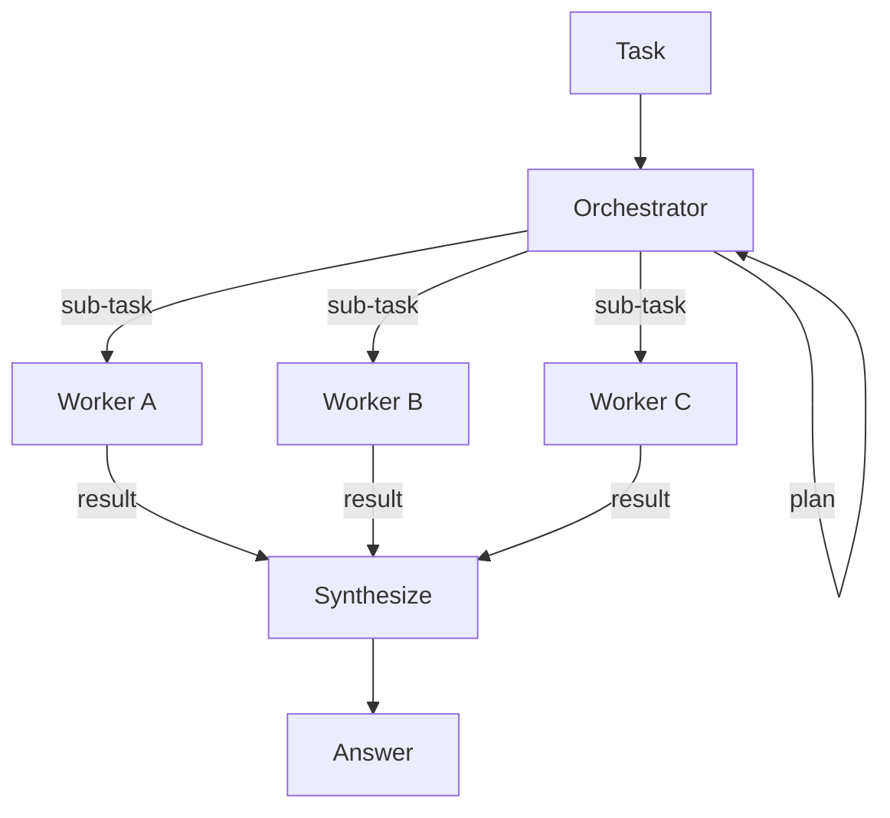

import Callout from '../../components/Callout.astro';

A single agent works until the task outgrows one context window, one set of
tools, or one line of reasoning. Multiagent architecture is the answer to that
ceiling: split the work across agents that each do one thing well, then decide
how they coordinate. This post walks through the patterns from the simplest up,
starting with the one you'll reach for most.

## Orchestrator and workers

The most common multiagent pattern is also the simplest. One orchestrator agent breaks a task apart, hands each piece to a specialist worker, and stitches the results back together. Workers never talk to each other — they only report up. That one constraint is what keeps the system debuggable: every decision has a single owner, and the trace reads straight down the page.



Here is the loop in its barest form. No framework, just a dispatch function and a
list of workers, so the control flow has nowhere to hide.

```python
def orchestrate(task, workers, llm):
    # 1. Plan: split the task into sub-tasks, each tagged with a worker.
    plan = llm.plan(task, roster=list(workers))

    # 2. Fan out: run each sub-task on its assigned worker.
    results = []
    for step in plan:
        worker = workers[step.worker]
        results.append(worker.run(step.instruction))

    # 3. Synthesize: fold the worker outputs into one answer.
    return llm.synthesize(task, plan, results)
```

The three phases — plan, fan out, synthesize — are worth naming because each
fails differently. A bad *plan* sends work to the wrong specialist. A bad *fan
out* lets one slow or looping worker stall the whole request. A bad *synthesis*
throws away good sub-results by summarizing them badly.

<Callout type="tip" title="Make workers stateless">
Give each worker only the sub-task and the context it needs, not the running
conversation. Stateless workers are independently retryable and can run in
parallel — the moment a worker depends on another's memory, you have lost both.
</Callout>

The fan-out step above is sequential, but nothing forces it to be: sub-tasks
with no dependency between them can run concurrently, and the orchestrator simply
waits for all of them before synthesizing. We'll add that — and a way to detect
when two sub-tasks *do* depend on each other — in the next section.

## Parallelism and dependencies

The trick is to stop thinking of the plan as a list and start thinking of it as
a graph. Each step declares which other steps it depends on; a step with no
unmet dependencies is *ready* and can run immediately. Fan out every ready step
at once, wait for the batch, then recompute what became ready. Repeat until the
graph is drained. This is just a topological sort with the tie-breaks resolved by
running everything at the same level in parallel — the same shape a build system
uses to schedule targets. The one cost of batching this way is a mild
straggler effect: the batch can't advance until its slowest step finishes, so a
single long-running worker briefly holds back peers that were otherwise ready to
start.

```python
from concurrent.futures import ThreadPoolExecutor

def orchestrate_parallel(task, workers, llm):
    # Each step now carries step.id and step.deps (ids it waits on).
    plan = llm.plan(task, roster=list(workers))
    results, done = {}, set()

    with ThreadPoolExecutor() as pool:
        while len(done) < len(plan):
            ready = [s for s in plan
                     if s.id not in done and set(s.deps) <= done]
            if not ready:
                raise RuntimeError("dependency cycle: no step can run")

            futures = {
                pool.submit(workers[s.worker].run, s.instruction,
                            deps={d: results[d] for d in s.deps}): s
                for s in ready
            }
            for fut, s in futures.items():
                results[s.id] = fut.result()
                done.add(s.id)

    return llm.synthesize(task, plan, results)
```

If $n$ independent sub-tasks each take time $t$, the sequential loop costs $n
\cdot t$ while the graph costs the length of its longest dependency chain — often
much closer to $t$. The dependencies you *do* have set the floor on how fast you
can go; everything else overlaps.

<Callout type="warning" title="A bad plan can deadlock">
Because the schedule comes from an LLM, nothing guarantees the dependency graph
is acyclic. Two steps that each list the other leave `ready` empty forever. The
guard above turns that silent hang into a loud error — never trust the plan to
be a valid DAG.
</Callout>

## Beyond one orchestrator

The orchestrator is a hub-and-spoke shape, but it isn't the only one. Two others
show up constantly:

- **Pipeline.** Agents form a line — each one's output is the next one's input,
  like retrieve → draft → edit. There's no central planner; the topology *is* the
  plan. Reach for it when the stages are fixed and the order never changes.
- **Debate.** Several agents answer the same question independently, then a judge
  agent (or a majority vote) picks or merges. The redundancy costs tokens but
  catches the errors a single chain would confidently ship.

The through-line across all four patterns is the same: every extra agent buys you
focus at the price of a coordination seam, and each seam is somewhere the system
can fail. Add an agent only when one context genuinely can't hold the job.

Start with the orchestrator, make its workers stateless and parallel, and add a
debate or pipeline only where a single pass isn't trustworthy enough. In the next
post we'll wire these agents to real tools — and see how tool errors, not
reasoning errors, become the thing you actually spend your time taming.
